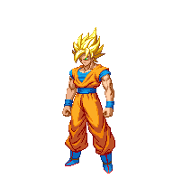
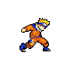
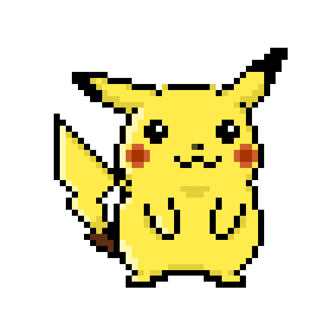
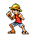

<!-- ══════════════════════════════════════════════════════════════════ -->
<!--                      Z E R O  —  README.md                       -->
<!-- ══════════════════════════════════════════════════════════════════ -->

<div align="center">

<!-- 🔥 TOP WAVE BANNER -->


<!-- ████ MULTICOLOR ANIMATED ZERO NAME ████ -->


```
███████╗███████╗██████╗  ██████╗
╚══███╔╝██╔════╝██╔══██╗██╔═══██╗
  ███╔╝ █████╗  ██████╔╝██║   ██║
 ███╔╝  ██╔══╝  ██╔══██╗██║   ██║
███████╗███████╗██║  ██║╚██████╔╝
╚══════╝╚══════╝╚═╝  ╚═╝ ╚═════╝
```

<!-- 🔤 ROLE TYPING -->


<br/><br/>

<!-- 🔥 GOKU — HERO ENTRY — FIRST & BIG -->


<br/>

> ### *"Power comes in response to a need, not a desire."*
> *— Son Goku &nbsp;|&nbsp; Also me before every coding session 💀*

</div>

---

## 🧬 `whoami`

```python
class Zero:
    name         = "ZERO"
    aka          = "IN-zero-FINITY"
    roles        = ["Programmer 💻", "Entrepreneur 🚀", "Anime Maniac 🎌"]
    learning     = ["Python 🐍", "JavaScript ⚡", "More langs incoming..."]
    goal         = "Build real products. Leave a legacy."
    current_arc  = "Training Arc — getting stronger every commit 🔥"

    def philosophy(self):
        return "Jo shuru kiya, woh khatam karta hun. Zero se shuru, infinity tak jaaunga. 🌌"
```

> 🧠 **This is my practice battlefield** — Python, JS, experiments, small tools.  
> 🔥 **Real projects?** → **[IN-zero-FINITY](https://github.com/Infinity0-0)** pe milenge.

---

## 🗺️ My Arc — The Roadmap

<div align="center">

| ⚔️ Skill | 🔥 Status | 🎯 Focus |
|----------|-----------|---------|
| 🐍 Python | `Training Arc` | Basics → Scripts → Projects |
| ⚡ JavaScript | `Training Arc` | ES6+ → DOM → Backend |
| 🌐 Web Dev | `Next Arc` | HTML/CSS → React |
| 🗄️ Databases | `Future Arc` | SQL → NoSQL |
| 🤖 AI / ML | `Final Boss` | The endgame 🗡️ |
| 💼 Startup | `Always On` | Building in silence 🤫 |

</div>

<br/>

<div align="center">
<!-- Naruto + Kid Goku — mid-page grind energy -->

&nbsp;&nbsp;&nbsp;&nbsp;&nbsp;&nbsp;&nbsp;&nbsp;&nbsp;&nbsp;&nbsp;&nbsp;&nbsp;&nbsp;&nbsp;&nbsp;&nbsp;&nbsp;&nbsp;&nbsp;&nbsp;&nbsp;&nbsp;&nbsp;

</div>

---

## ⚡ Tech Stack

<div align="center">


</div>

---

## 💡 The Code & The Dream

```js
const zero = {
  mission:   "Programmer aur Entrepreneur — dono ek saath",
  practice:  ["Python mini tools", "JS challenges", "Web pages", "APIs"],
  mindset:   "Every line of code is a step toward the empire 👑",
  secret:    "Woh din aayega jab logo ko mera naam pata hoga. 🔥"
};

while (zero.alive) {
  zero.grind();
  zero.learn();
  zero.build();
  // never stop, never settle
}
```

---

## 📊 Stats Board

<div align="center">


<br/><br/>


</div>

---

## 🎌 Anime Crew — My Daily Motivation

> *Unka grind dekh ke mera grind remind hota hai.* 🫡

<div align="center">

<table>
  <tr>
    <td align="center" width="200">
      <br/><br/>
      <b>⚡ Pikachu</b><br/>
      <sub>Small. Electric. Unstoppable.<br/>Mood = me on a good day.</sub>
    </td>
    <td align="center" width="200">
      <br/><br/>
      <b>🏴‍☠️ Luffy</b><br/>
      <sub>No plan. Just pure will.<br/>Becomes King anyway. 👑</sub>
    </td>
  </tr>
</table>

</div>

---

## 🔗 Find Me

<div align="center">

[](https://github.com/Infinity0-0)
[](https://github.com/IN-zero-FINITY)

</div>

---

<div align="center">

<br/>

*"Abhi toh sirf shuruwat hai."* &nbsp;—&nbsp; **ZERO** 🔥

<br/>

<!-- 🌊 FOOTER WAVE -->


</div>
